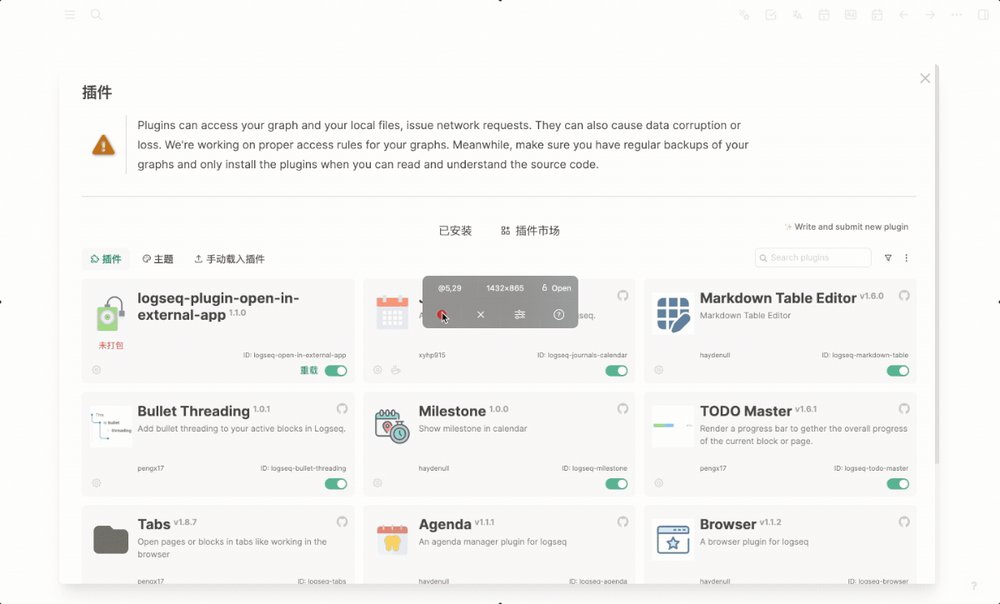

# logseq-plugin-open-in-external-app
> 使用外部软件打开 logseq 中的文件

[](https://github.com/haydenull/logseq-plugin-open-in-external-app/releases)
[](https://github.com/haydenull/logseq-plugin-open-in-external-app/blob/main/LICENSE)

[English](./README.md) | 简体中文

## 示例


示例使用了 [vscode](https://code.visualstudio.com/) 以及 [Excalidraw Schema Editor](https://marketplace.visualstudio.com/items?itemName=pomdtr.excalidraw-editor) 插件。

## 使用方法
1. 安装插件
2. 填写配置信息
3. 重启 Logseq 使配置生效

## 插件配置

menus: 注册的菜单
  - menuName: 菜单名
  - pathRegExp: 从 block 内容获取文件路径正则表达式
  - extensionName: 打开文件的后缀名
  - apps:
    - title: app 名
    - openSchema: 调用 app 的 schema, `{path}` 会被替换为文件路径

## 配置示例

```json
{
  "menus": [
    {
      "menuName": "Excalidraw",
      "pathRegExp": "\\[\\[([\\d\\D]+)]]",
      "extensionName": "excalidraw",
      "apps": [
        {
          "title": "vscode",
          "openSchema": "vscode://file/{path}"
        }
      ]
    }
  ]
}
```
